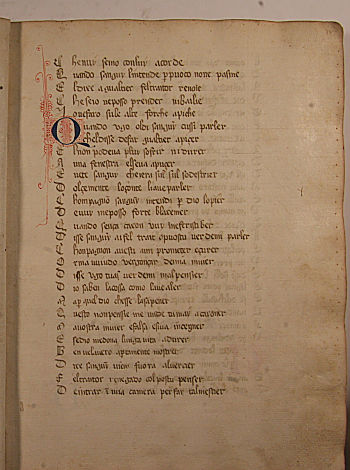

<h1 id="ms-intro">{{page.title}}</h1>

        <h2>Table of Contents</h2>
        <ol>
            <li><a href="{{site.baseurl}}/praxis/p-praxis.html">Edition Criteria</a></li>
            <li><a href="{{site.baseurl}}/p-facsimile/p-facsimile-0001.html">Digital Edition</a></li>
            <li><a href="{{site.baseurl}}/editions/facsimiles/p-facsimile.html">Digital Facsimile</a></li>
            <li>Concordance</li>
            <li>Codicology</li>
            <li>Glossary</li>
        </ol>

